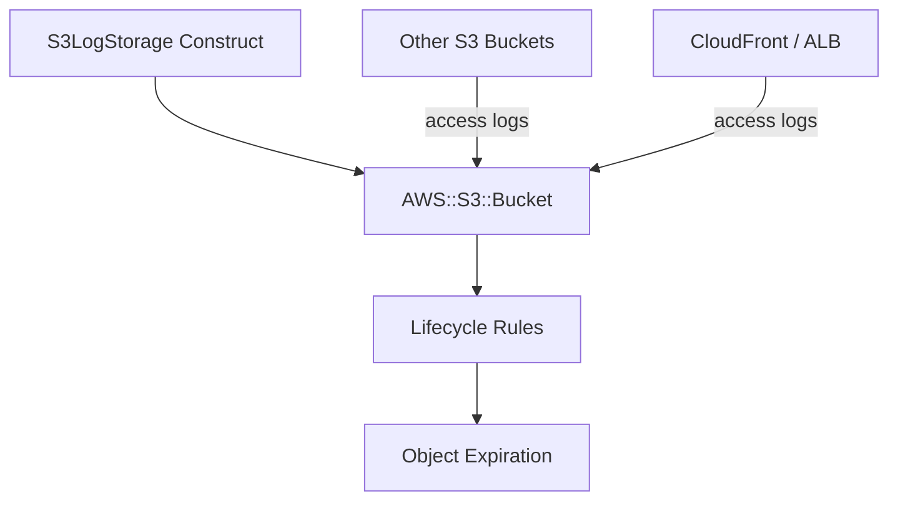

# @sevenpico/cdk-construct-s3-log-storage

> **Agent Context**: Before implementing this spec, read [`spec/AGENT-CONTEXT.md`](./AGENT-CONTEXT.md) for the full project context, functional architecture pattern, JSII constraints, and README generation requirements.

## Dependencies
- `@sevenpico/cdk-context` — **must be implemented first**
- `@sevenpico/cdk-construct-s3-bucket` — **must be implemented first**

## Package
`@sevenpico/cdk-construct-s3-log-storage`
Directory: `packages/cdk-construct-s3-log-storage`

## Source Terraform Module
https://github.com/SevenPico/terraform-aws-s3-log-storage

## Purpose
Provisions an S3 bucket pre-configured for receiving access logs from other AWS services (S3, CloudFront, CloudTrail, ALB). Uses `S3Bucket` from `@sevenpico/cdk-construct-s3-bucket` internally. Optionally creates an SQS queue for bucket event notifications.

---

## CDK Imports
```typescript
import { aws_s3 as s3, aws_sqs as sqs, Duration } from 'aws-cdk-lib';
import { S3Bucket, S3BucketProps } from '@sevenpico/cdk-construct-s3-bucket';
```

## Props Interface (JSII-exported)

```typescript
import { Context } from '@sevenpico/cdk-context';

export interface S3LogStorageProps {
  readonly context: Context;

  /** Override the bucket name. Default: context.id */
  readonly bucketName?: string;

  /** Enable versioning. Default: true */
  readonly versioningEnabled?: boolean;

  /** SSE algorithm. Default: 'AES256' */
  readonly sseAlgorithm?: string;

  /** KMS key ARN for SSE-KMS */
  readonly kmsKeyArn?: string;

  /** Enable S3 bucket key. Default: false */
  readonly bucketKeyEnabled?: boolean;

  /** Block public ACLs. Default: true */
  readonly blockPublicAcls?: boolean;

  /** Block public bucket policies. Default: true */
  readonly blockPublicPolicy?: boolean;

  /** Ignore public ACLs. Default: true */
  readonly ignorePublicAcls?: boolean;

  /** Restrict public buckets. Default: true */
  readonly restrictPublicBuckets?: boolean;

  /** Force destroy. Default: false */
  readonly forceDestroy?: boolean;

  /** Enforce SSL-only requests. Default: true (stricter default for log buckets) */
  readonly allowSslRequestsOnly?: boolean;

  /** Additional IAM policy documents (JSON strings) */
  readonly sourcePolicyDocuments?: string[];

  /** S3 object ownership. Default: 'ObjectWriter' (required for log delivery ACLs) */
  readonly objectOwnership?: string;

  /** Lifecycle rules */
  readonly lifecycleRules?: S3LifecycleRule[];  // from @sevenpico/cdk-construct-s3-bucket

  /** Logging target bucket name (for access logs of this bucket) */
  readonly accessLogBucketName?: string;

  /** Logging prefix */
  readonly accessLogPrefix?: string;

  /** Enable bucket event notifications. Default: false */
  readonly notificationsEnabled?: boolean;

  /** Notification target type. Default: 'SQS' */
  readonly notificationsType?: string;

  /** S3 key prefix filter for notifications */
  readonly notificationsPrefix?: string;

  /** Enable MFA delete. Default: false */
  readonly mfaDeleteEnabled?: boolean;
}
```

---

## Pure Functions (`src/s3-log-storage-fns.ts`)

```typescript
import { S3BucketProps } from '@sevenpico/cdk-construct-s3-bucket';
import { Context } from '@sevenpico/cdk-context';

/** Map S3LogStorageProps to S3BucketProps for the underlying bucket. */
export const toS3BucketProps = (ctx: Context, props: S3LogStorageProps): S3BucketProps => ({
  context:                  ctx,
  bucketName:               props.bucketName,
  versioningEnabled:        props.versioningEnabled ?? true,
  sseAlgorithm:             props.sseAlgorithm ?? 'AES256',
  kmsKeyArn:                props.kmsKeyArn,
  bucketKeyEnabled:         props.bucketKeyEnabled ?? false,
  blockPublicAcls:          props.blockPublicAcls ?? true,
  blockPublicPolicy:        props.blockPublicPolicy ?? true,
  ignorePublicAcls:         props.ignorePublicAcls ?? true,
  restrictPublicBuckets:    props.restrictPublicBuckets ?? true,
  forceDestroy:             props.forceDestroy ?? false,
  allowSslRequestsOnly:     props.allowSslRequestsOnly ?? true,
  sourcePolicyDocuments:    props.sourcePolicyDocuments,
  objectOwnership:          props.objectOwnership ?? 'ObjectWriter',
  lifecycleRules:           props.lifecycleRules,
  loggingBucketName:        props.accessLogBucketName,
  loggingPrefix:            props.accessLogPrefix,
  mfaDeleteEnabled:         props.mfaDeleteEnabled ?? false,
});

export const notificationQueueProps = (ctx: Context): sqs.QueueProps => ({
  queueName: `${contextId(ctx)}-notifications`,
  removalPolicy: RemovalPolicy.DESTROY,
});
```

---

## Construct Class (`src/s3-log-storage.ts`)

```typescript
export class S3LogStorage extends Construct {
  public readonly bucket?: s3.Bucket;
  public readonly notificationQueue?: sqs.Queue;

  constructor(scope: Construct, id: string, props: S3LogStorageProps) {
    super(scope, id);
    if (!isEnabled(props.context)) return;

    const s3Construct = new S3Bucket(this, 'Bucket', toS3BucketProps(props.context, props));
    this.bucket = s3Construct.bucket;

    if (props.notificationsEnabled && props.notificationsType === 'SQS') {
      this.notificationQueue = new sqs.Queue(this, 'NotificationQueue',
        notificationQueueProps(props.context)
      );
      this.bucket?.addEventNotification(
        s3.EventType.OBJECT_CREATED,
        new s3n.SqsDestination(this.notificationQueue),
        props.notificationsPrefix ? { prefix: props.notificationsPrefix } : undefined
      );
    }

    Object.entries(contextTags(props.context)).forEach(([k, v]) => Tags.of(this).add(k, v));
  }
}
```

> CDK import needed for S3 event notifications: `import { aws_s3_notifications as s3n } from 'aws-cdk-lib'`

---

## Public Properties

| Property | Type | Description |
|----------|------|-------------|
| `bucket` | `s3.Bucket \| undefined` | The log storage bucket |
| `notificationQueue` | `sqs.Queue \| undefined` | SQS queue for bucket notifications (if enabled) |

---

## Context Usage

| Context Field | Usage |
|---------------|-------|
| `context.id` | Bucket name (default) and notification queue name suffix |
| `context.tags` | Applied to all resources |
| `context.enabled` | If false, no resources created |

---

## Key Differences from `S3Bucket`

- Default `objectOwnership` is `'ObjectWriter'` (required for log delivery ACL grants)
- Default `allowSslRequestsOnly` is `true` (stricter)
- Adds optional SQS notification queue for bucket events
- Intended to be used as the target of other buckets' `serverAccessLogsBucket`

---

## BDD Tests

### Feature: Bucket Naming

**Scenario: Log bucket name uses context ID**
- **Given** a context with namespace `7p`, stage `prod`, name `logs`
- **When** an `S3LogStorage` construct is created
- **Then** the S3 bucket name is `7p-prod-logs`

### Feature: Access Logging Target

**Scenario: Bucket is configured as an access log target**
- **Given** a valid context
- **When** an `S3LogStorage` construct is created
- **Then** the bucket has `AccessControl: LogDeliveryWrite` or equivalent ACL

### Feature: Lifecycle Rules

**Scenario: Default expiration lifecycle rule applied**
- **Given** no `expirationDays` prop (uses default)
- **When** an `S3LogStorage` construct is created
- **Then** the bucket has a lifecycle rule with object expiration

### Feature: Tagging

**Scenario: Context tags applied to log bucket**
- **Given** a context with tags
- **When** an `S3LogStorage` construct is created
- **Then** the S3 bucket resource has those tags

### Feature: Disabled Construct

**Scenario: No resources created when context is disabled**
- **Given** a context with `enabled: false`
- **When** an `S3LogStorage` construct is created
- **Then** no `AWS::S3::Bucket` resources exist in the stack

## README

Generate a `README.md` following the template in [`spec/AGENT-CONTEXT.md`](./AGENT-CONTEXT.md#readme-generation-requirement).

The Mermaid diagram should show:


