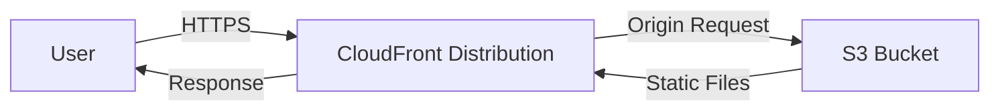

# @sevenpico/cdk-construct-s3-website

> **Agent Context**: Before implementing this spec, read [`spec/AGENT-CONTEXT.md`](./AGENT-CONTEXT.md) for the full project context, functional architecture pattern, JSII constraints, and README generation requirements.

## Dependencies
- `@sevenpico/cdk-context` — **must be implemented first**

## Package
`@sevenpico/cdk-construct-s3-website`
Directory: `packages/cdk-construct-s3-website`

## Source Terraform Module
https://github.com/SevenPico/terraform-aws-s3-website

## Purpose
Provisions a static website hosted on S3 with a CloudFront distribution. Supports optional WAF (CloudFront-scoped), optional Route53 DNS alias, custom error responses, CORS, and geo-restriction.

---

## CDK Imports
```typescript
import {
  aws_s3 as s3,
  aws_cloudfront as cloudfront,
  aws_cloudfront_origins as origins,
  aws_route53 as route53,
  aws_route53_targets as targets,
  aws_certificatemanager as acm,
  aws_wafv2 as wafv2,
  Duration,
} from 'aws-cdk-lib';
```

## Props Interface (JSII-exported)

```typescript
import { Context } from '@sevenpico/cdk-context';

export interface CustomErrorResponse {
  readonly httpStatus: number;
  readonly responseHttpStatus?: number;
  readonly responsePagePath?: string;
  readonly ttl?: number;  // seconds
}

export interface GeoRestriction {
  readonly restrictionType: string;   // 'whitelist' | 'blacklist' | 'none'
  readonly locations?: string[];      // ISO 3166-1 alpha-2 codes
}

export interface S3WebsiteProps {
  readonly context: Context;

  /** ACM certificate ARN (must be in us-east-1 for CloudFront). Required. */
  readonly acmCertificateArn: string;

  /** Additional CloudFront aliases (CNAMEs) */
  readonly additionalAliases?: string[];

  /** Default root object. Default: 'index.html' */
  readonly defaultRootObject?: string;

  /** Custom error responses. Default: 404 → index.html with 10s TTL */
  readonly customErrorResponses?: CustomErrorResponse[];

  /** Enable WAF on the CloudFront distribution. Default: false */
  readonly wafEnabled?: boolean;

  /** Enable CloudFront access logging. Default: false */
  readonly cloudfrontAccessLoggingEnabled?: boolean;

  /** S3 bucket ID to receive CloudFront access logs */
  readonly cloudfrontAccessLogBucketId?: string;

  /** CloudFront access log prefix */
  readonly cloudfrontAccessLogPrefix?: string;

  /** Enable S3 origin access logging. Default: true */
  readonly s3AccessLoggingEnabled?: boolean;

  /** S3 bucket ID to receive S3 access logs */
  readonly s3AccessLogBucketId?: string;

  /** S3 access log prefix */
  readonly s3AccessLogPrefix?: string;

  /** CORS allowed origins */
  readonly corsAllowedOrigins?: string[];

  /** IAM principal ARNs allowed to deploy to the S3 origin bucket */
  readonly deploymentPrincipalArns?: string[];

  /** Route53 hosted zone ID for DNS alias. Required if dnAliasEnabled = true */
  readonly parentZoneId?: string;

  /** Route53 hosted zone name */
  readonly parentZoneName?: string;

  /** Create a Route53 DNS alias record. Default: false */
  readonly dnsAliasEnabled?: boolean;

  /** TLS protocol version. Default: 'TLSv1.2_2021' */
  readonly tlsProtocolVersion?: string;

  /** Geo restriction configuration */
  readonly geoRestriction?: GeoRestriction;

  /** CloudFront function associations */
  readonly functionAssociations?: cloudfront.FunctionAssociation[];
}
```

---

## Pure Functions (`src/s3-website-fns.ts`)

```typescript
export const defaultCustomErrorResponses = (): cloudfront.ErrorResponse[] => ([
  {
    httpStatus: 404,
    responseHttpStatus: 200,
    responsePagePath: '/index.html',
    ttl: Duration.seconds(10),
  },
]);

export const cloudfrontGeoRestriction = (geo?: GeoRestriction): cloudfront.GeoRestriction => {
  if (!geo || geo.restrictionType === 'none') return cloudfront.GeoRestriction.noRestriction();
  if (geo.restrictionType === 'whitelist') return cloudfront.GeoRestriction.allowlist(...(geo.locations ?? []));
  return cloudfront.GeoRestriction.denylist(...(geo.locations ?? []));
};

export const originBucketProps = (ctx: Context, props: S3WebsiteProps): s3.BucketProps => ({
  bucketName:         `${contextId(ctx)}-origin`,
  blockPublicAccess:  s3.BlockPublicAccess.BLOCK_ALL,
  removalPolicy:      RemovalPolicy.RETAIN,
  versioned:          false,
  encryption:         s3.BucketEncryption.S3_MANAGED,
});

export const distributionProps = (
  ctx: Context,
  props: S3WebsiteProps,
  originBucket: s3.IBucket,
  oac: cloudfront.S3OriginAccessControl,
  certificate: acm.ICertificate,
  webAclArn?: string,
): cloudfront.DistributionProps => ({
  defaultBehavior: {
    origin: origins.S3BucketOrigin.withOriginAccessControl(originBucket, { originAccessControl: oac }),
    viewerProtocolPolicy: cloudfront.ViewerProtocolPolicy.REDIRECT_TO_HTTPS,
    functionAssociations: props.functionAssociations,
  },
  domainNames:           [contextId(ctx), ...(props.additionalAliases ?? [])],
  certificate,
  defaultRootObject:     props.defaultRootObject ?? 'index.html',
  errorResponses:        (props.customErrorResponses ?? []).map(mapErrorResponse) ?? defaultCustomErrorResponses(),
  webAclId:              webAclArn,
  geoRestriction:        cloudfrontGeoRestriction(props.geoRestriction),
  minimumProtocolVersion: mapTlsVersion(props.tlsProtocolVersion ?? 'TLSv1.2_2021'),
  logBucket:             props.cloudfrontAccessLoggingEnabled ? undefined : undefined,  // set imperatively
});

export const mapErrorResponse = (e: CustomErrorResponse): cloudfront.ErrorResponse => ({
  httpStatus:         e.httpStatus,
  responseHttpStatus: e.responseHttpStatus,
  responsePagePath:   e.responsePagePath,
  ttl:                e.ttl !== undefined ? Duration.seconds(e.ttl) : undefined,
});

export const mapTlsVersion = (v: string): cloudfront.SecurityPolicyProtocol => {
  const map: Record<string, cloudfront.SecurityPolicyProtocol> = {
    'TLSv1.2_2021': cloudfront.SecurityPolicyProtocol.TLS_V1_2_2021,
    'TLSv1.2_2019': cloudfront.SecurityPolicyProtocol.TLS_V1_2_2019,
    'TLSv1.2_2018': cloudfront.SecurityPolicyProtocol.TLS_V1_2_2018,
  };
  return map[v] ?? cloudfront.SecurityPolicyProtocol.TLS_V1_2_2021;
};
```

---

## Construct Class (`src/s3-website.ts`)

```typescript
export class S3Website extends Construct {
  public readonly originBucket?: s3.Bucket;
  public readonly distribution?: cloudfront.Distribution;
  public readonly dnsRecord?: route53.ARecord;

  constructor(scope: Construct, id: string, props: S3WebsiteProps) {
    super(scope, id);
    if (!isEnabled(props.context)) return;

    // Origin bucket
    this.originBucket = new s3.Bucket(this, 'OriginBucket', originBucketProps(props.context, props));

    // OAC
    const oac = new cloudfront.S3OriginAccessControl(this, 'OAC', {
      signing: cloudfront.Signing.SIGV4_NO_OVERRIDE,
    });

    // Certificate (looked up, not created — must exist in us-east-1)
    const certificate = acm.Certificate.fromCertificateArn(this, 'Cert', props.acmCertificateArn);

    // Optional WAF — use CfnWebACL (L1) for CLOUDFRONT scope
    let webAclArn: string | undefined;
    if (props.wafEnabled) {
      const webAcl = new wafv2.CfnWebACL(this, 'WebAcl', {
        scope: 'CLOUDFRONT',
        defaultAction: { allow: {} },
        visibilityConfig: {
          cloudWatchMetricsEnabled: true,
          metricName: `${contextId(props.context)}-waf`,
          sampledRequestsEnabled: true,
        },
        rules: defaultWafRules(props.context),
      });
      webAclArn = webAcl.attrArn;
    }

    // CloudFront distribution
    this.distribution = new cloudfront.Distribution(this, 'Distribution',
      distributionProps(props.context, props, this.originBucket, oac, certificate, webAclArn)
    );

    // CloudFront access logging
    if (props.cloudfrontAccessLoggingEnabled && props.cloudfrontAccessLogBucketId) {
      // Apply via CfnDistribution escape hatch if needed
    }

    // Deployment principals — grant put to origin bucket
    (props.deploymentPrincipalArns ?? []).forEach(arn => {
      this.originBucket!.grantPut(new iam.ArnPrincipal(arn));
    });

    // DNS alias
    if (props.dnsAliasEnabled && props.parentZoneId) {
      const zone = route53.HostedZone.fromHostedZoneAttributes(this, 'Zone', {
        hostedZoneId: props.parentZoneId,
        zoneName: props.parentZoneName ?? '',
      });
      this.dnsRecord = new route53.ARecord(this, 'DnsAlias', {
        zone,
        recordName: contextId(props.context),
        target: route53.RecordTarget.fromAlias(new targets.CloudFrontTarget(this.distribution)),
      });
    }

    Object.entries(contextTags(props.context)).forEach(([k, v]) => Tags.of(this).add(k, v));
  }
}
```

---

## Default WAF Rules

When `wafEnabled = true`, apply these AWS managed rule groups (matching the Terraform defaults):
- `AWSManagedRulesCommonRuleSet`
- `AWSManagedRulesAmazonIpReputationList`
- `AWSManagedRulesKnownBadInputsRuleSet`
- `AWSManagedRulesSQLiRuleSet`
- `AWSManagedRulesLinuxRuleSet`
- `AWSManagedRulesUnixRuleSet`
- `AWSManagedRulesAnonymousIpList`

Implement `defaultWafRules(ctx: Context): wafv2.CfnWebACL.RuleProperty[]` as a pure function.

---

## Public Properties

| Property | Type | Description |
|----------|------|-------------|
| `originBucket` | `s3.Bucket \| undefined` | S3 origin bucket |
| `distribution` | `cloudfront.Distribution \| undefined` | CloudFront distribution |
| `dnsRecord` | `route53.ARecord \| undefined` | Route53 alias record (if dnsAliasEnabled) |

---

## Context Usage

| Context Field | Usage |
|---------------|-------|
| `context.id` | Origin bucket name suffix, CloudFront domain name alias, WAF metric name |
| `context.tags` | Applied to all resources |
| `context.enabled` | If false, no resources created |

---

## BDD Tests

### Feature: Bucket Naming

**Scenario: Website bucket name uses context ID**
- **Given** a context with namespace `7p`, stage `prod`, name `web`
- **When** an `S3Website` construct is created
- **Then** the S3 bucket name is `7p-prod-web`

### Feature: Static Website Hosting

**Scenario: Website hosting enabled on the bucket**
- **Given** a valid context
- **When** an `S3Website` construct is created
- **Then** the bucket has static website hosting configured
- **And** the index document is set

### Feature: CloudFront Distribution

**Scenario: CloudFront distribution created when enabled**
- **Given** `cloudFrontEnabled: true`
- **When** an `S3Website` construct is created
- **Then** an `AWS::CloudFront::Distribution` resource exists

**Scenario: No CloudFront distribution by default**
- **Given** no `cloudFrontEnabled` prop
- **When** an `S3Website` construct is created
- **Then** no `AWS::CloudFront::Distribution` resource exists

### Feature: Tagging

**Scenario: Context tags applied to website bucket**
- **Given** a context with tags
- **When** an `S3Website` construct is created
- **Then** the S3 bucket resource has those tags

### Feature: Disabled Construct

**Scenario: No resources created when context is disabled**
- **Given** a context with `enabled: false`
- **When** an `S3Website` construct is created
- **Then** no `AWS::S3::Bucket` resources exist in the stack

## README

Generate a `README.md` following the template in [`spec/AGENT-CONTEXT.md`](./AGENT-CONTEXT.md#readme-generation-requirement).

The Mermaid diagram should show:


