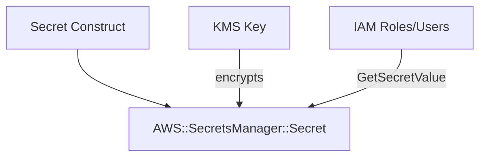

# @sevenpico/cdk-construct-secret

> **Agent Context**: Before implementing this spec, read [`spec/AGENT-CONTEXT.md`](./AGENT-CONTEXT.md) for the full project context, functional architecture pattern, JSII constraints, and README generation requirements.

## Dependencies
- `@sevenpico/cdk-context` — **must be implemented first**

## Package
`@sevenpico/cdk-construct-secret`
Directory: `packages/cdk-construct-secret`

## Source Terraform Module
https://github.com/SevenPico/terraform-aws-secret

## Purpose
Provisions an AWS Secrets Manager secret with an optional dedicated KMS key, optional SNS topic for change notifications, optional cross-region replication, and configurable read access principals.

---

## CDK Imports
```typescript
import {
  aws_secretsmanager as sm,
  aws_kms as kms,
  aws_sns as sns,
  aws_iam as iam,
} from 'aws-cdk-lib';
```

## Props Interface (JSII-exported)

```typescript
import { Context } from '@sevenpico/cdk-context';

export interface SecretReadPrincipal {
  readonly type: string;            // 'AWS' | 'Service' | 'Federated'
  readonly identifiers: string[];
  readonly conditions?: SecretPrincipalCondition[];
}

export interface SecretPrincipalCondition {
  readonly test: string;
  readonly variable: string;
  readonly values: string[];
}

export interface SecretProps {
  readonly context: Context;

  /** Initial secret value. Default: empty string. Manage via console/CLI after creation. */
  readonly secretString?: string;

  /** Secret description */
  readonly description?: string;

  /** Create a dedicated KMS key for the secret. Default: true */
  readonly createKmsKey?: boolean;

  /** Existing KMS key ARN to use instead of creating one. Ignored if createKmsKey = true */
  readonly kmsKeyArn?: string;

  /** KMS key pending deletion window in days. Default: 30 */
  readonly kmsKeyDeletionWindowInDays?: number;

  /** Enable KMS key rotation. Default: true */
  readonly kmsKeyEnableKeyRotation?: boolean;

  /** If true, use multi-region KMS key. Default: false */
  readonly kmsKeyMultiRegion?: boolean;

  /** Ignore changes to the secret value after initial creation. Default: false */
  readonly secretIgnoreChanges?: boolean;

  /** Create an SNS topic for secret update notifications. Default: false */
  readonly createSns?: boolean;

  /** IAM principals allowed to read the secret */
  readonly secretReadPrincipals?: SecretReadPrincipal[];

  /** IAM principals allowed to publish to the SNS topic */
  readonly snsPubPrincipals?: SecretReadPrincipal[];

  /** IAM principals allowed to subscribe to the SNS topic */
  readonly snsSubPrincipals?: SecretReadPrincipal[];

  /** Regions to replicate the secret to */
  readonly replicaRegions?: string[];

  /** Context attributes override for the secret resource (appended to base context) */
  readonly secretAttributesOverride?: string[];

  /** Context attributes override for the KMS key resource */
  readonly kmsKeyAttributesOverride?: string[];
}
```

---

## Pure Functions (`src/secret-fns.ts`)

```typescript
import { Context, contextId, extendContext } from '@sevenpico/cdk-context';

/** Compute the context for the secret resource, optionally overriding attributes. */
export const secretContext = (ctx: Context, props: SecretProps): Context =>
  props.secretAttributesOverride
    ? extendContext(ctx, { attributes: props.secretAttributesOverride })
    : extendContext(ctx, { attributes: ['secret'] });

/** Compute the context for the KMS key resource. */
export const kmsKeyContext = (ctx: Context, props: SecretProps): Context =>
  props.kmsKeyAttributesOverride
    ? extendContext(ctx, { attributes: props.kmsKeyAttributesOverride })
    : extendContext(ctx, { attributes: ['key'] });

/** Build KMS key props. */
export const secretKmsKeyProps = (ctx: Context, props: SecretProps): kms.KeyProps => ({
  description:       `KMS key for secret ${contextId(ctx)}`,
  enableKeyRotation: props.kmsKeyEnableKeyRotation ?? true,
  pendingWindow:     Duration.days(props.kmsKeyDeletionWindowInDays ?? 30),
  multiRegion:       props.kmsKeyMultiRegion ?? false,
  removalPolicy:     RemovalPolicy.RETAIN,
});

/** Build SecretManager secret props. */
export const smSecretProps = (
  ctx: Context,
  props: SecretProps,
  encryptionKey?: kms.IKey
): sm.SecretProps => ({
  secretName:    contextId(ctx),
  description:   props.description,
  encryptionKey,
  replicaRegions: (props.replicaRegions ?? []).map(region => ({ region })),
  removalPolicy:  RemovalPolicy.RETAIN,
  secretStringValue: props.secretString
    ? SecretValue.unsafePlainText(props.secretString)
    : undefined,
});

/** Build IAM policy statement granting read access to the secret. */
export const secretReadPolicyStatement = (
  secretArn: string,
  kmsKeyArn: string | undefined,
  principals: SecretReadPrincipal[]
): iam.PolicyStatement[] => {
  if (principals.length === 0) return [];
  // Return two statements: one for secretsmanager:GetSecretValue on the secret,
  // one for kms:Decrypt + kms:DescribeKey on the key (if key exists)
  return [
    new iam.PolicyStatement({
      actions: ['secretsmanager:GetSecretValue', 'secretsmanager:DescribeSecret'],
      resources: [secretArn],
      principals: principals.map(mapPrincipal),
      conditions: buildConditions(principals),
    }),
    ...(kmsKeyArn ? [new iam.PolicyStatement({
      actions: ['kms:Decrypt', 'kms:DescribeKey'],
      resources: [kmsKeyArn],
      principals: principals.map(mapPrincipal),
    })] : []),
  ];
};

const mapPrincipal = (p: SecretReadPrincipal): iam.IPrincipal => { ... };
const buildConditions = (principals: SecretReadPrincipal[]): Record<string, unknown> => { ... };
```

---

## Construct Class (`src/secret.ts`)

```typescript
export class Secret extends Construct {
  public readonly secret?: sm.Secret;
  public readonly kmsKey?: kms.Key;
  public readonly kmsAlias?: kms.Alias;
  public readonly snsTopic?: sns.Topic;

  constructor(scope: Construct, id: string, props: SecretProps) {
    super(scope, id);
    if (!isEnabled(props.context)) return;

    const sCtx = secretContext(props.context, props);
    const kCtx = kmsKeyContext(props.context, props);

    // KMS key
    let encryptionKey: kms.IKey | undefined;
    if (props.createKmsKey !== false) {  // default: create key
      this.kmsKey = new kms.Key(this, 'Key', secretKmsKeyProps(kCtx, props));
      this.kmsAlias = new kms.Alias(this, 'KeyAlias', {
        aliasName: `alias/${contextId(kCtx)}`,
        targetKey: this.kmsKey,
      });
      encryptionKey = this.kmsKey;
    } else if (props.kmsKeyArn) {
      encryptionKey = kms.Key.fromKeyArn(this, 'ExternalKey', props.kmsKeyArn);
    }

    // Secret
    this.secret = new sm.Secret(this, 'Secret', smSecretProps(sCtx, props, encryptionKey));

    // Resource policy: read principals
    if (props.secretReadPrincipals?.length) {
      secretReadPolicyStatement(
        this.secret.secretArn,
        this.kmsKey?.keyArn,
        props.secretReadPrincipals
      ).forEach(stmt => this.secret!.addToResourcePolicy(stmt));
    }

    // SNS topic for notifications
    if (props.createSns) {
      this.snsTopic = new sns.Topic(this, 'Topic', {
        topicName: `${contextId(sCtx)}-updates`,
        masterKey: encryptionKey,
      });
      // add pub/sub principal policies
    }

    Object.entries(contextTags(props.context)).forEach(([k, v]) => Tags.of(this).add(k, v));
  }
}
```

---

## Public Properties

| Property | Type | Description |
|----------|------|-------------|
| `secret` | `sm.Secret \| undefined` | The Secrets Manager secret |
| `kmsKey` | `kms.Key \| undefined` | Dedicated KMS key (if created) |
| `kmsAlias` | `kms.Alias \| undefined` | Alias for the KMS key |
| `snsTopic` | `sns.Topic \| undefined` | SNS topic for change notifications |

---

## Context Usage

| Context Field | Usage |
|---------------|-------|
| `context.id` | Base for secret name and KMS key alias |
| `secretContext.id` | Secret name: `{id}-secret` (default attributes) |
| `kmsKeyContext.id` | KMS key alias: `alias/{id}-key` (default attributes) |
| `context.tags` | Applied to all resources |
| `context.enabled` | If false, no resources created |

---

## BDD Tests

### Feature: Secret Naming

**Scenario: Secret name uses context ID**
- **Given** a context with namespace `7p`, stage `prod`, name `db-password`
- **When** a `Secret` construct is created
- **Then** an `AWS::SecretsManager::Secret` resource exists with name `7p-prod-db-password`

### Feature: KMS Encryption

**Scenario: Secret encrypted with provided KMS key**
- **Given** `kmsKeyArn: 'arn:aws:kms:...'`
- **When** a `Secret` construct is created
- **Then** the secret is encrypted with the specified KMS key ARN

**Scenario: Secret uses default encryption when no KMS key provided**
- **Given** no `kmsKeyArn` prop
- **When** a `Secret` construct is created
- **Then** the secret uses AWS-managed encryption

### Feature: Secret Value

**Scenario: Initial secret string provided**
- **Given** `secretString: 'initial-value'`
- **When** a `Secret` construct is created
- **Then** the secret resource has a `SecretString` configured

### Feature: Tagging

**Scenario: Context tags applied to secret**
- **Given** a context with tags
- **When** a `Secret` construct is created
- **Then** the Secrets Manager secret has those tags

### Feature: Disabled Construct

**Scenario: No resources created when context is disabled**
- **Given** a context with `enabled: false`
- **When** a `Secret` construct is created
- **Then** no `AWS::SecretsManager::Secret` resources exist in the stack

## README

Generate a `README.md` following the template in [`spec/AGENT-CONTEXT.md`](./AGENT-CONTEXT.md#readme-generation-requirement).

The Mermaid diagram should show:


