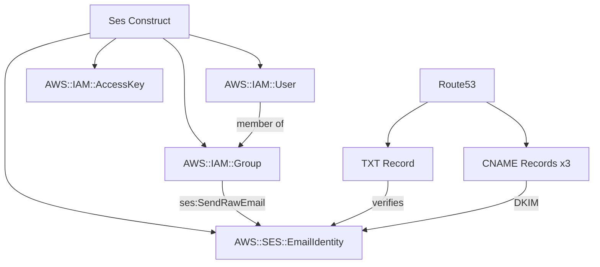

# @sevenpico/cdk-construct-ses

> **Agent Context**: Before implementing this spec, read [`spec/AGENT-CONTEXT.md`](./AGENT-CONTEXT.md) for the full project context, functional architecture pattern, JSII constraints, and README generation requirements.

## Dependencies
- `@sevenpico/cdk-context` — **must be implemented first**

## Package
`@sevenpico/cdk-construct-ses`
Directory: `packages/cdk-construct-ses`

## Source Terraform Module
https://github.com/SevenPico/terraform-aws-ses

## Purpose
Provisions an AWS SES domain identity with optional Route53 DNS verification records, optional DKIM records, an IAM group with SES send permissions, and an optional IAM system user for programmatic email sending.

> **CDK Note:** SES L2 constructs in CDK are limited. Use `aws_ses.CfnEmailIdentity` (L1) for domain identity and DKIM. Route53 records use the standard L2 `aws_route53.TxtRecord` and `aws_route53.CnameRecord`.

---

## CDK Imports
```typescript
import {
  aws_ses as ses,
  aws_route53 as route53,
  aws_iam as iam,
} from 'aws-cdk-lib';
```

## Props Interface (JSII-exported)

```typescript
import { Context } from '@sevenpico/cdk-context';

export interface SesProps {
  readonly context: Context;

  /** Route53 hosted zone ID for DNS verification records */
  readonly zoneId?: string;

  /** Create Route53 TXT record for domain verification. Default: false */
  readonly verifyDomain?: boolean;

  /** Create Route53 CNAME records for DKIM verification. Default: false */
  readonly verifyDkim?: boolean;

  /** IAM permissions granted to the SES user/group. Default: ['ses:SendRawEmail'] */
  readonly iamPermissions?: string[];

  /** Resource ARNs for the IAM policy. Default: ['*'] */
  readonly iamAllowedResources?: string[];

  /** Create an IAM group with SES send permissions. Default: true */
  readonly sesGroupEnabled?: boolean;

  /** IAM group name override. Default: derived from context.id */
  readonly sesGroupName?: string;

  /** IAM group path. Default: '/' */
  readonly sesGroupPath?: string;

  /** Create an IAM user for programmatic SES access. Default: true */
  readonly sesUserEnabled?: boolean;

  /** Create IAM access keys for the user. Default: true */
  readonly createIamAccessKey?: boolean;

  /** Force destroy user with non-Terraform-managed resources. Default: false */
  readonly forceDestroy?: boolean;

  /** IAM user path. Default: '/' */
  readonly path?: string;

  /** Inline policy JSON strings to attach to the user */
  readonly inlinePolicies?: string[];

  /** Managed policy ARNs to attach to the user */
  readonly policyArns?: string[];

  /** Permissions boundary ARN */
  readonly permissionsBoundary?: string;
}
```

---

## Pure Functions (`src/ses-fns.ts`)

```typescript
import { aws_ses as ses } from 'aws-cdk-lib';
import { Context, contextId } from '@sevenpico/cdk-context';

/** The SES domain identity is the context.id (which should be a domain name or subdomain) */
export const sesIdentityName = (ctx: Context): string => contextId(ctx);

export const sesGroupName = (ctx: Context, props: SesProps): string =>
  props.sesGroupName ?? `${contextId(ctx)}-ses`;

export const sesUserName = (ctx: Context): string => `${contextId(ctx)}-ses-user`;

export const sesPolicyStatement = (props: SesProps, identityArn: string): iam.PolicyStatement =>
  new iam.PolicyStatement({
    actions:   props.iamPermissions ?? ['ses:SendRawEmail'],
    resources: (props.iamAllowedResources ?? []).length > 0
                 ? props.iamAllowedResources!
                 : [identityArn],
  });
```

---

## Construct Class (`src/ses.ts`)

```typescript
export class Ses extends Construct {
  public readonly emailIdentity?: ses.CfnEmailIdentity;
  public readonly iamGroup?: iam.Group;
  public readonly iamUser?: iam.User;
  public readonly accessKey?: iam.AccessKey;

  constructor(scope: Construct, id: string, props: SesProps) {
    super(scope, id);
    if (!isEnabled(props.context)) return;

    // SES domain identity (L1)
    this.emailIdentity = new ses.CfnEmailIdentity(this, 'Identity', {
      emailIdentity: sesIdentityName(props.context),
    });

    // Route53 domain verification TXT record
    if (props.verifyDomain && props.zoneId) {
      const zone = route53.HostedZone.fromHostedZoneId(this, 'Zone', props.zoneId);
      new route53.TxtRecord(this, 'VerificationRecord', {
        zone,
        recordName: `_amazonses.${sesIdentityName(props.context)}`,
        values:     [this.emailIdentity.attrDkimDnsTokenValue1], // verification token
      });
    }

    // DKIM CNAME records (3 records required)
    if (props.verifyDkim && props.zoneId) {
      const zone = route53.HostedZone.fromHostedZoneId(this, 'DkimZone', props.zoneId);
      [1, 2, 3].forEach(i => {
        const tokenName = (this.emailIdentity as any)[`attrDkimDnsTokenName${i}`];
        const tokenValue = (this.emailIdentity as any)[`attrDkimDnsTokenValue${i}`];
        new route53.CnameRecord(this, `DkimRecord${i}`, {
          zone,
          recordName: tokenName,
          domainName: tokenValue,
        });
      });
    }

    // IAM group
    if (props.sesGroupEnabled !== false) {
      this.iamGroup = new iam.Group(this, 'Group', {
        groupName: sesGroupName(props.context, props),
        path:      props.sesGroupPath ?? '/',
      });

      this.iamGroup.addToPolicy(
        sesPolicyStatement(props, this.emailIdentity.attrArn)
      );
    }

    // IAM user
    if (props.sesUserEnabled !== false) {
      this.iamUser = new iam.User(this, 'User', {
        userName:            sesUserName(props.context),
        path:                props.path ?? '/',
        permissionsBoundary: props.permissionsBoundary
          ? iam.ManagedPolicy.fromManagedPolicyArn(this, 'Boundary', props.permissionsBoundary)
          : undefined,
      });

      if (this.iamGroup) {
        this.iamUser.addToGroup(this.iamGroup);
      }

      if (props.createIamAccessKey !== false) {
        this.accessKey = new iam.AccessKey(this, 'AccessKey', {
          user: this.iamUser,
        });
      }

      (props.policyArns ?? []).forEach((arn, i) =>
        this.iamUser!.addManagedPolicy(iam.ManagedPolicy.fromManagedPolicyArn(this, `Policy${i}`, arn))
      );
    }

    Object.entries(contextTags(props.context)).forEach(([k, v]) => Tags.of(this).add(k, v));
  }
}
```

---

## Public Properties

| Property | Type | Description |
|----------|------|-------------|
| `emailIdentity` | `ses.CfnEmailIdentity \| undefined` | The SES domain identity |
| `iamGroup` | `iam.Group \| undefined` | IAM group with SES send permissions |
| `iamUser` | `iam.User \| undefined` | IAM user for programmatic sending |
| `accessKey` | `iam.AccessKey \| undefined` | Access key for the IAM user |

---

## Context Usage

| Context Field | Usage |
|---------------|-------|
| `context.id` | SES domain identity name, group/user name base |
| `context.tags` | Applied to all taggable resources |
| `context.enabled` | If false, no resources created |

---

## BDD Tests

### Feature: SES Identity

**Scenario: Domain identity created with context ID**
- **Given** a context with id `mail.example.com`
- **When** a `Ses` construct is created
- **Then** a `AWS::SES::EmailIdentity` resource exists with `emailIdentity: 'mail.example.com'`

### Feature: DNS Verification

**Scenario: TXT verification record created when verifyDomain is true**
- **Given** `verifyDomain: true` and a `zoneId`
- **When** a `Ses` construct is created
- **Then** a `AWS::Route53::RecordSet` TXT record exists for domain verification

**Scenario: No DNS records created when verifyDomain is false**
- **Given** `verifyDomain: false`
- **When** a `Ses` construct is created
- **Then** no Route53 record sets exist for SES verification

### Feature: IAM Group

**Scenario: IAM group created with SES send permissions by default**
- **Given** no `sesGroupEnabled` prop
- **When** a `Ses` construct is created
- **Then** an `AWS::IAM::Group` resource exists
- **And** the group policy includes `ses:SendRawEmail`

**Scenario: No IAM group when sesGroupEnabled is false**
- **Given** `sesGroupEnabled: false`
- **When** a `Ses` construct is created
- **Then** no `AWS::IAM::Group` resource exists

### Feature: Disabled Construct

**Scenario: No resources created when context is disabled**
- **Given** a context with `enabled: false`
- **When** a `Ses` construct is created
- **Then** no `AWS::SES::EmailIdentity` resources exist in the stack

## README

Generate a `README.md` following the template in [`spec/AGENT-CONTEXT.md`](./AGENT-CONTEXT.md#readme-generation-requirement).

The Mermaid diagram should show:


