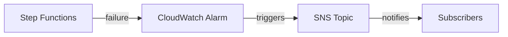

# @sevenpico/cdk-construct-sfn-error-notification

> **Agent Context**: Before implementing this spec, read [`spec/AGENT-CONTEXT.md`](./AGENT-CONTEXT.md) for the full project context, functional architecture pattern, JSII constraints, and README generation requirements.

## Dependencies
- `@sevenpico/cdk-context` — **must be implemented first**
- `@sevenpico/cdk-construct-sqs-queue` — **must be implemented first**

## Package
`@sevenpico/cdk-construct-sfn-error-notification`
Directory: `packages/cdk-construct-sfn-error-notification`

## Source Terraform Module
https://github.com/SevenPico/terraform-aws-step-function-error-notification

## Purpose
Monitors a single STANDARD Step Functions state machine for execution failures. Provisions an SQS dead-letter queue, two CloudWatch alarms (rate-based and volume-based on DLQ depth), an EventBridge rule that captures failed executions and routes them to the DLQ, and an EventBridge Pipe that re-invokes the state machine for automatic reprocessing.

---

## CDK Imports
```typescript
import {
  aws_cloudwatch as cw,
  aws_cloudwatch_actions as cw_actions,
  aws_sqs as sqs,
  aws_iam as iam,
  aws_logs as logs,
  aws_events as events,
  aws_events_targets as events_targets,
  aws_pipes as pipes,
  aws_sns as sns,
  Duration,
} from 'aws-cdk-lib';
```

## Props Interface (JSII-exported)

```typescript
import { Context } from '@sevenpico/cdk-context';

export interface SfnErrorNotificationProps {
  readonly context: Context;

  /** ARN of the Step Functions state machine to monitor. Required. */
  readonly stateMachineArn: string;

  /** ARN of the SNS topic for the rate alarm. Required. */
  readonly rateAlarmSnsTopicArn: string;

  /** ARN of the SNS topic for the volume alarm. Required. */
  readonly volumeAlarmSnsTopicArn: string;

  /** KMS key ID for SQS encryption */
  readonly sqsKmsKeyId?: string;

  /** SQS queue name override. Default: derived from context.id */
  readonly sqsQueueName?: string;

  /** SQS message retention in seconds. Default: 604800 (7 days) */
  readonly sqsMessageRetentionSeconds?: number;

  /** SQS visibility timeout in seconds. Default: 2 */
  readonly sqsVisibilityTimeoutSeconds?: number;

  /** EventBridge rule name override. Default: derived from context.id */
  readonly eventbridgeRuleName?: string;

  /** Alarm evaluation period in seconds. Default: 60 */
  readonly alarmPeriodSeconds?: number;

  /** Data points to trigger alarm. Default: 2 */
  readonly alarmDatapointsToAlarm?: number;

  /** Number of evaluation periods. Default: 2 */
  readonly alarmEvaluationPeriods?: number;

  /** EventBridge Pipe name override. Default: derived from context.id */
  readonly eventbridgePipeName?: string;

  /** Batch size for the EventBridge Pipe. Default: 1 */
  readonly eventbridgePipeBatchSize?: number;

  /** Pipe log level. Default: 'ERROR' */
  readonly eventbridgePipeLogLevel?: string;

  /** CloudWatch log retention for pipe in days. Default: 90 */
  readonly cloudwatchLogRetentionDays?: number;

  /** Input template for the pipe target (Step Functions input). Default: '<$.detail.input>' */
  readonly targetStepFunctionInputTemplate?: string;

  /** KMS key ID for SNS topic (alarm actions) */
  readonly snsKmsKeyId?: string;

  /** Custom rate alarm name */
  readonly rateAlarmName?: string;

  /** Custom volume alarm name */
  readonly volumeAlarmName?: string;
}
```

---

## Pure Functions (`src/sfn-error-notification-fns.ts`)

```typescript
export const dlqContext = (ctx: Context): Context =>
  extendContext(ctx, { attributes: ['dlq'] });

export const rateAlarmName = (ctx: Context, props: SfnErrorNotificationProps): string =>
  props.rateAlarmName ?? `${contextId(ctx)}-dlq-rate`;

export const volumeAlarmName = (ctx: Context, props: SfnErrorNotificationProps): string =>
  props.volumeAlarmName ?? `${contextId(ctx)}-dlq-volume`;

export const pipeName = (ctx: Context, props: SfnErrorNotificationProps): string =>
  props.eventbridgePipeName ?? `${contextId(ctx)}-pipe`;

export const eventbridgeRuleName = (ctx: Context, props: SfnErrorNotificationProps): string =>
  props.eventbridgeRuleName ?? `${contextId(ctx)}-failed`;

/** EventBridge rule pattern matching FAILED Step Function executions for the given state machine ARN */
export const failedExecutionPattern = (stateMachineArn: string): events.EventPattern => ({
  source:     ['aws.states'],
  detailType: ['Step Functions Execution Status Change'],
  detail:     {
    status:          ['FAILED', 'TIMED_OUT', 'ABORTED'],
    stateMachineArn: [stateMachineArn],
  },
});

export const rateAlarmProps = (ctx: Context, props: SfnErrorNotificationProps, queue: sqs.IQueue): cw.AlarmProps => ({
  alarmName:          rateAlarmName(ctx, props),
  metric:             new cw.MathExpression({
    expression:   'RATE(m1)',
    usingMetrics: { m1: queue.metricApproximateNumberOfMessagesVisible() },
    period:       Duration.seconds(props.alarmPeriodSeconds ?? 60),
  }),
  threshold:          0,
  comparisonOperator: cw.ComparisonOperator.GREATER_THAN_THRESHOLD,
  datapointsToAlarm:  props.alarmDatapointsToAlarm ?? 2,
  evaluationPeriods:  props.alarmEvaluationPeriods ?? 2,
  treatMissingData:   cw.TreatMissingData.NOT_BREACHING,
});

export const volumeAlarmProps = (ctx: Context, props: SfnErrorNotificationProps, queue: sqs.IQueue): cw.AlarmProps => ({
  alarmName:          volumeAlarmName(ctx, props),
  metric:             queue.metricApproximateNumberOfMessagesVisible({
    period: Duration.seconds(props.alarmPeriodSeconds ?? 60),
  }),
  threshold:          0,
  comparisonOperator: cw.ComparisonOperator.GREATER_THAN_THRESHOLD,
  datapointsToAlarm:  props.alarmDatapointsToAlarm ?? 2,
  evaluationPeriods:  props.alarmEvaluationPeriods ?? 2,
  treatMissingData:   cw.TreatMissingData.NOT_BREACHING,
});
```

---

## Construct Class (`src/sfn-error-notification.ts`)

```typescript
export class SfnErrorNotification extends Construct {
  public readonly deadLetterQueue?: sqs.Queue;
  public readonly rateAlarm?: cw.Alarm;
  public readonly volumeAlarm?: cw.Alarm;
  public readonly eventbridgeRule?: events.Rule;
  public readonly pipe?: pipes.CfnPipe;

  constructor(scope: Construct, id: string, props: SfnErrorNotificationProps) {
    super(scope, id);
    if (!isEnabled(props.context)) return;

    // DLQ
    const dCtx = dlqContext(props.context);
    this.deadLetterQueue = new sqs.Queue(this, 'Dlq', {
      queueName:         props.sqsQueueName ?? contextId(dCtx),
      retentionPeriod:   Duration.seconds(props.sqsMessageRetentionSeconds ?? 604800),
      visibilityTimeout: Duration.seconds(props.sqsVisibilityTimeoutSeconds ?? 2),
      encryptionMasterKey: props.sqsKmsKeyId
        ? kms.Key.fromKeyArn(this, 'DlqKey', props.sqsKmsKeyId)
        : undefined,
    });

    // CloudWatch alarms
    this.rateAlarm = new cw.Alarm(this, 'RateAlarm', rateAlarmProps(props.context, props, this.deadLetterQueue));
    this.rateAlarm.addAlarmAction(new cw_actions.SnsAction(
      sns.Topic.fromTopicArn(this, 'RateTopic', props.rateAlarmSnsTopicArn)
    ));

    this.volumeAlarm = new cw.Alarm(this, 'VolumeAlarm', volumeAlarmProps(props.context, props, this.deadLetterQueue));
    this.volumeAlarm.addAlarmAction(new cw_actions.SnsAction(
      sns.Topic.fromTopicArn(this, 'VolumeTopic', props.volumeAlarmSnsTopicArn)
    ));

    // EventBridge rule: capture failed executions → route to DLQ
    this.eventbridgeRule = new events.Rule(this, 'FailedRule', {
      ruleName:     eventbridgeRuleName(props.context, props),
      eventPattern: failedExecutionPattern(props.stateMachineArn),
    });
    this.eventbridgeRule.addTarget(new events_targets.SqsQueue(this.deadLetterQueue));

    // EventBridge Pipe: DLQ → Step Functions (reprocessing)
    const pipeRole = new iam.Role(this, 'PipeRole', {
      assumedBy: new iam.ServicePrincipal('pipes.amazonaws.com'),
    });
    this.deadLetterQueue.grantConsumeMessages(pipeRole);
    pipeRole.addToPolicy(new iam.PolicyStatement({
      actions:   ['states:StartExecution'],
      resources: [props.stateMachineArn],
    }));

    const pipeLogGroup = new logs.LogGroup(this, 'PipeLogGroup', {
      logGroupName:  `/aws/pipes/${pipeName(props.context, props)}`,
      retention:     (props.cloudwatchLogRetentionDays ?? 90) as logs.RetentionDays,
      removalPolicy: RemovalPolicy.DESTROY,
    });

    this.pipe = new pipes.CfnPipe(this, 'Pipe', {
      name:             pipeName(props.context, props),
      roleArn:          pipeRole.roleArn,
      source:           this.deadLetterQueue.queueArn,
      target:           props.stateMachineArn,
      sourceParameters: {
        sqsQueueParameters: { batchSize: props.eventbridgePipeBatchSize ?? 1 },
      },
      targetParameters: {
        stepFunctionStateMachineParameters: {
          invocationType: 'FIRE_AND_FORGET',
        },
        inputTemplate: props.targetStepFunctionInputTemplate ?? '<$.detail.input>',
      },
      logConfiguration: {
        cloudwatchLogsLogDestination: { logGroupArn: pipeLogGroup.logGroupArn },
        level: props.eventbridgePipeLogLevel ?? 'ERROR',
      },
    });

    Object.entries(contextTags(props.context)).forEach(([k, v]) => Tags.of(this).add(k, v));
  }
}
```

---

## Public Properties

| Property | Type | Description |
|----------|------|-------------|
| `deadLetterQueue` | `sqs.Queue \| undefined` | DLQ for failed executions |
| `rateAlarm` | `cw.Alarm \| undefined` | Rate alarm on DLQ growth |
| `volumeAlarm` | `cw.Alarm \| undefined` | Volume alarm on DLQ depth |
| `eventbridgeRule` | `events.Rule \| undefined` | Rule capturing failed SFN executions |
| `pipe` | `pipes.CfnPipe \| undefined` | Pipe re-routing DLQ messages to SFN |

---

## Context Usage

| Context Field | Usage |
|---------------|-------|
| `context.id` | Base name for DLQ, alarms, rule, and pipe |
| DLQ context | `extendContext(ctx, { attributes: ['dlq'] })` |
| `context.tags` | Applied to all resources |
| `context.enabled` | If false, no resources created |

---

## BDD Tests

### Feature: DLQ Naming

**Scenario: DLQ name derived from context with dlq attribute**
- **Given** a context with namespace `7p`, stage `prod`, name `workflow`
- **When** a `SfnErrorNotification` is created
- **Then** an SQS queue named `7p-prod-workflow-dlq` exists

### Feature: Failed Execution Capture

**Scenario: EventBridge rule captures FAILED, TIMED_OUT, and ABORTED executions**
- **Given** a valid context and `stateMachineArn`
- **When** a `SfnErrorNotification` is created
- **Then** an EventBridge rule exists with detail matching `status: [FAILED, TIMED_OUT, ABORTED]`
- **And** the rule target is the DLQ

### Feature: Alarm Defaults

**Scenario: Standard SFN alarms use 2 datapoints over 2 periods**
- **Given** a valid context
- **When** a `SfnErrorNotification` is created without alarm config
- **Then** both alarms have `datapointsToAlarm: 2` and `evaluationPeriods: 2`

> Note: Standard SFN uses stricter defaults (2/2) vs Lambda error notification (1/5) — matching the source Terraform module behavior.

### Feature: Reprocessing Pipe

**Scenario: EventBridge Pipe routes DLQ messages back to state machine**
- **Given** a valid context and `stateMachineArn`
- **When** a `SfnErrorNotification` is created
- **Then** a `AWS::Pipes::Pipe` exists with source as DLQ and target as the state machine ARN

### Feature: Disabled Construct

**Scenario: No resources created when context is disabled**
- **Given** a context with `enabled: false`
- **When** a `SfnErrorNotification` is created
- **Then** no resources of any type exist in the stack

## README

Generate a `README.md` following the template in [`spec/AGENT-CONTEXT.md`](./AGENT-CONTEXT.md#readme-generation-requirement).

The Mermaid diagram should show:


