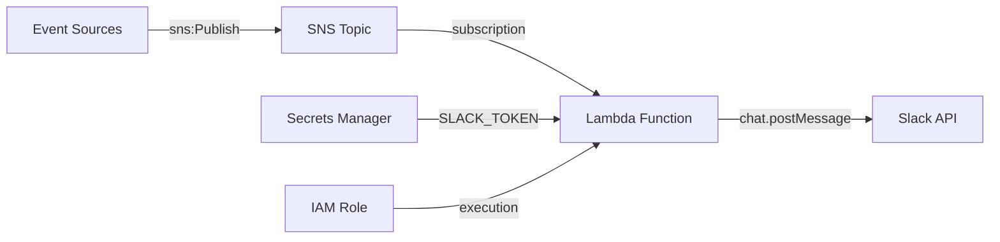

# @sevenpico/cdk-construct-slackbot

> **Agent Context**: Before implementing this spec, read [`spec/AGENT-CONTEXT.md`](./AGENT-CONTEXT.md) for the full project context, functional architecture pattern, JSII constraints, and README generation requirements.

## Dependencies
- `@sevenpico/cdk-context` — **must be implemented first**
- `@sevenpico/cdk-construct-sns` — **must be implemented first**
- `@sevenpico/cdk-construct-lambda-function` — **must be implemented first**

## Package
`@sevenpico/cdk-construct-slackbot`
Directory: `packages/cdk-construct-slackbot`

## Source Terraform Module
https://github.com/SevenPico/terraform-aws-slackbot

## Purpose
Provisions a Slackbot integration: an SNS topic that receives notification events, a Lambda function that reads the SNS messages and posts to Slack channels via the Slack API, an SNS subscription wiring the topic to the Lambda, and IAM permissions allowing the Lambda to read the Slack token from AWS Secrets Manager.

The Lambda source code (Python 3.x handler) must be provided by the caller as a local asset path or S3 reference. The standard handler is `main.lambda_handler`.

---

## CDK Imports
```typescript
import {
  aws_lambda as lambda,
  aws_sns as sns,
  aws_sns_subscriptions as subs,
  aws_iam as iam,
  aws_logs as logs,
} from 'aws-cdk-lib';
```

## Props Interface (JSII-exported)

```typescript
import { Context } from '@sevenpico/cdk-context';

export interface SlackbotProps {
  readonly context: Context;

  /**
   * Map of SNS topic attribute name to Slack channel ID.
   * Example: { 'alerts': 'C01234ABCDE', 'deployments': 'C09876ZYXWV' }
   * Required.
   */
  readonly slackChannels: Record<string, string>;

  /**
   * ARN of the AWS Secrets Manager secret containing the Slack bot token.
   * Required.
   */
  readonly slackTokenSecretArn: string;

  /**
   * KMS key ARN for decrypting the Slack token secret.
   * Required if the secret is KMS-encrypted.
   */
  readonly slackTokenSecretKmsKeyArn?: string;

  /**
   * Path to local Lambda deployment package directory or ZIP file.
   * The Lambda handler is expected at `main.lambda_handler`.
   * Default: './lambda' (relative to the CDK app entry point)
   */
  readonly lambdaCodePath?: string;

  /** Lambda runtime. Default: 'python3.9' */
  readonly lambdaRuntime?: string;

  /** CloudWatch log retention in days. Default: 90 */
  readonly cloudwatchLogExpirationDays?: number;

  /**
   * IAM principals allowed to publish to the SNS topic.
   * Key: principal type ('Service' | 'AWS'). Value: list of identifiers.
   */
  readonly snsPubPrincipals?: Record<string, string[]>;

  /**
   * IAM principals allowed to subscribe to the SNS topic.
   * Key: principal type. Value: list of identifiers.
   */
  readonly snsSubPrincipals?: Record<string, string[]>;
}
```

---

## Pure Functions (`src/slackbot-fns.ts`)

```typescript
import { aws_lambda as lambda, Duration } from 'aws-cdk-lib';
import { Context, contextId, extendContext } from '@sevenpico/cdk-context';

export const topicContext = (ctx: Context): Context =>
  extendContext(ctx, { attributes: ['notifications'] });

export const lambdaContext = (ctx: Context): Context =>
  extendContext(ctx, { attributes: ['handler'] });

export const slackbotLambdaProps = (
  ctx: Context,
  props: SlackbotProps,
): lambda.FunctionProps => ({
  functionName:    contextId(lambdaContext(ctx)),
  handler:         'main.lambda_handler',
  runtime:         new lambda.Runtime(props.lambdaRuntime ?? 'python3.9'),
  code:            lambda.Code.fromAsset(props.lambdaCodePath ?? './lambda'),
  timeout:         Duration.seconds(30),
  environment: {
    SLACK_CHANNELS:        JSON.stringify(props.slackChannels),
    SLACK_TOKEN_SECRET_ARN: props.slackTokenSecretArn,
  },
});

export const secretsManagerPolicyStatement = (
  secretArn: string,
  kmsKeyArn?: string,
): iam.PolicyStatement[] => {
  const statements: iam.PolicyStatement[] = [
    new iam.PolicyStatement({
      actions:   ['secretsmanager:GetSecretValue'],
      resources: [secretArn],
    }),
  ];
  if (kmsKeyArn) {
    statements.push(new iam.PolicyStatement({
      actions:   ['kms:Decrypt', 'kms:DescribeKey'],
      resources: [kmsKeyArn],
    }));
  }
  return statements;
};
```

---

## Construct Class (`src/slackbot.ts`)

```typescript
export class Slackbot extends Construct {
  public readonly snsTopic?: sns.Topic;
  public readonly lambdaFn?: lambda.Function;

  constructor(scope: Construct, id: string, props: SlackbotProps) {
    super(scope, id);
    if (!isEnabled(props.context)) return;

    const tCtx = topicContext(props.context);
    const lCtx = lambdaContext(props.context);

    // SNS topic for notifications
    this.snsTopic = new sns.Topic(this, 'Topic', {
      topicName: contextId(tCtx),
    });

    // Publish permissions
    Object.entries(props.snsPubPrincipals ?? {}).forEach(([type, ids]) =>
      ids.forEach(id => this.snsTopic!.grantPublish(buildPrincipal(type, id)))
    );

    // IAM execution role for Lambda
    const role = new iam.Role(this, 'LambdaRole', {
      roleName:  `${contextId(lCtx)}-role`,
      assumedBy: new iam.ServicePrincipal('lambda.amazonaws.com'),
    });
    role.addManagedPolicy(
      iam.ManagedPolicy.fromAwsManagedPolicyName('service-role/AWSLambdaBasicExecutionRole')
    );
    secretsManagerPolicyStatement(props.slackTokenSecretArn, props.slackTokenSecretKmsKeyArn)
      .forEach(s => role.addToPolicy(s));

    // Lambda function
    const logGroup = new logs.LogGroup(this, 'LogGroup', {
      logGroupName:  `/aws/lambda/${contextId(lCtx)}`,
      retention:     (props.cloudwatchLogExpirationDays ?? 90) as logs.RetentionDays,
      removalPolicy: RemovalPolicy.DESTROY,
    });

    this.lambdaFn = new lambda.Function(this, 'Handler', {
      ...slackbotLambdaProps(props.context, props),
      role,
      logGroup,
    });

    // SNS → Lambda subscription
    this.snsTopic.addSubscription(new subs.LambdaSubscription(this.lambdaFn));

    Object.entries(contextTags(props.context)).forEach(([k, v]) => Tags.of(this).add(k, v));
  }
}

const buildPrincipal = (type: string, id: string): iam.IPrincipal => {
  switch (type) {
    case 'Service': return new iam.ServicePrincipal(id);
    case 'AWS':     return new iam.ArnPrincipal(id);
    default:        return new iam.ArnPrincipal(id);
  }
};
```

---

## Public Properties

| Property | Type | Description |
|----------|------|-------------|
| `snsTopic` | `sns.Topic \| undefined` | The SNS topic that receives notifications |
| `lambdaFn` | `lambda.Function \| undefined` | The Lambda handler posting to Slack |

---

## Context Usage

| Context Field | Usage |
|---------------|-------|
| `context.id` | Base for topic and lambda names |
| Topic context | `extendContext(ctx, { attributes: ['notifications'] })` |
| Lambda context | `extendContext(ctx, { attributes: ['handler'] })` |
| `context.tags` | Applied to all resources |
| `context.enabled` | If false, no resources created |

---

## Lambda Handler Contract

The Lambda function receives SNS events and posts messages to Slack. The function must:
- Read `SLACK_CHANNELS` env var (JSON map of attribute → channel ID)
- Read `SLACK_TOKEN_SECRET_ARN` env var (Secrets Manager ARN for bot token)
- Call Slack API `chat.postMessage` for each SNS record

The Lambda source code is **not included** in this construct — callers must provide a `lambdaCodePath` pointing to a directory containing `main.py` with a `lambda_handler` function.

---

## BDD Tests

### Feature: SNS Topic

**Scenario: SNS topic created with context-based name**
- **Given** a context with namespace `7p`, stage `prod`, name `slackbot`
- **When** a `Slackbot` construct is created
- **Then** an SNS topic named `7p-prod-slackbot-notifications` exists

### Feature: Lambda Subscription

**Scenario: Lambda function subscribes to SNS topic**
- **Given** a valid context, `slackChannels`, and `slackTokenSecretArn`
- **When** a `Slackbot` construct is created
- **Then** a Lambda function exists
- **And** an `AWS::SNS::Subscription` resource exists with the Lambda as endpoint

### Feature: Secrets Manager Access

**Scenario: Lambda role has GetSecretValue permission**
- **Given** `slackTokenSecretArn: 'arn:aws:secretsmanager:...'`
- **When** a `Slackbot` construct is created
- **Then** the Lambda execution role policy includes `secretsmanager:GetSecretValue` for that ARN

**Scenario: Lambda role has KMS decrypt permission when kmsKeyArn provided**
- **Given** `slackTokenSecretKmsKeyArn` is set
- **When** a `Slackbot` construct is created
- **Then** the Lambda execution role policy includes `kms:Decrypt` for that key ARN

### Feature: Disabled Construct

**Scenario: No resources created when context is disabled**
- **Given** a context with `enabled: false`
- **When** a `Slackbot` construct is created
- **Then** no `AWS::SNS::Topic` resources exist in the stack
- **And** no `AWS::Lambda::Function` resources exist in the stack

## README

Generate a `README.md` following the template in [`spec/AGENT-CONTEXT.md`](./AGENT-CONTEXT.md#readme-generation-requirement).

The Mermaid diagram should show:


