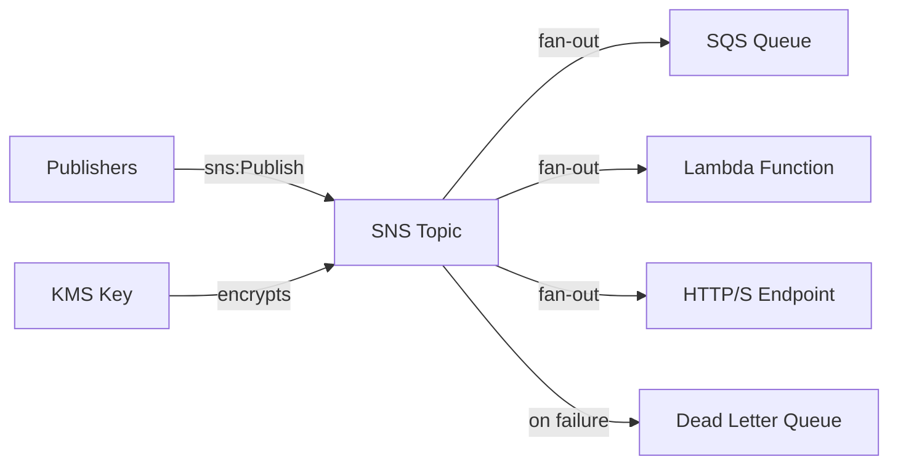

# @sevenpico/cdk-construct-sns

> **Agent Context**: Before implementing this spec, read [`spec/AGENT-CONTEXT.md`](./AGENT-CONTEXT.md) for the full project context, functional architecture pattern, JSII constraints, and README generation requirements.

## Dependencies
- `@sevenpico/cdk-context` — **must be implemented first**

## Package
`@sevenpico/cdk-construct-sns`
Directory: `packages/cdk-construct-sns`

## Source Terraform Module
https://github.com/SevenPicoforks/terraform-aws-sns-topic
(Chosen over SevenPico/terraform-aws-sns for its more complete feature set)

## Purpose
Provisions an SNS topic (standard or FIFO) with optional subscriptions, optional SQS dead-letter queue for failed deliveries, configurable KMS encryption, and flexible access policies for publishers and subscribers.

---

## CDK Imports
```typescript
import { aws_sns as sns, aws_sns_subscriptions as subs, aws_sqs as sqs, aws_kms as kms } from 'aws-cdk-lib';
```

## Props Interface (JSII-exported)

```typescript
import { Context } from '@sevenpico/cdk-context';

export interface SnsSubscriber {
  /** Subscription protocol: 'sqs' | 'lambda' | 'http' | 'https' | 'email' | 'sms' | 'application' */
  readonly protocol: string;
  /** Endpoint ARN/URL/email address */
  readonly endpoint: string;
  /** Enable raw message delivery. Default: false */
  readonly rawMessageDelivery?: boolean;
}

export interface SnsProps {
  readonly context: Context;

  /** Enable KMS encryption. Default: true */
  readonly encryptionEnabled?: boolean;

  /** KMS key ID or alias for SNS encryption. Default: 'alias/aws/sns' */
  readonly kmsMasterKeyId?: string;

  /** Create FIFO topic. Default: false */
  readonly fifoTopic?: boolean;

  /** Enable content-based deduplication (FIFO only). Default: false */
  readonly contentBasedDeduplication?: boolean;

  /** Map of subscriber name to subscriber config */
  readonly subscribers?: Record<string, SnsSubscriber>;

  /** AWS service identifiers (e.g. 'events.amazonaws.com') allowed to publish */
  readonly allowedAwsServicesForPublish?: string[];

  /** IAM ARNs allowed to publish to the topic */
  readonly allowedIamArnsForPublish?: string[];

  /** Custom SNS topic policy JSON (overrides generated policy) */
  readonly snsTopicPolicyJson?: string;

  /** Enable SQS dead-letter queue for failed deliveries. Default: false */
  readonly sqsDlqEnabled?: boolean;

  /** DLQ max message size in bytes. Default: 262144 */
  readonly sqsDlqMaxMessageSizeBytes?: number;

  /** DLQ message retention seconds. Default: 1209600 (14 days) */
  readonly sqsDlqMessageRetentionSeconds?: number;

  /** Create FIFO DLQ (requires fifoTopic = true). Default: false */
  readonly sqsDlqFifo?: boolean;

  /** KMS key ID for DLQ. Default: 'alias/aws/sqs' */
  readonly sqsQueueKmsMasterKeyId?: string;

  /** KMS data key reuse period for DLQ in seconds. Default: 300 */
  readonly sqsQueueKmsDataKeyReusePeriodSeconds?: number;

  /** Custom SNS delivery retry policy JSON */
  readonly deliveryPolicy?: string;

  /** Custom redrive policy JSON */
  readonly redrivePolicy?: string;

  /** Max receive count for redrive policy. Default: 5 */
  readonly redriveMaxReceiverCount?: number;
}
```

---

## Pure Functions (`src/sns-fns.ts`)

```typescript
import { aws_sns as sns, aws_sqs as sqs, aws_kms as kms, Duration } from 'aws-cdk-lib';
import { Context, contextId, extendContext } from '@sevenpico/cdk-context';

export const topicName = (ctx: Context, props: SnsProps): string =>
  props.fifoTopic ? `${contextId(ctx)}.fifo` : contextId(ctx);

export const dlqContext = (ctx: Context): Context =>
  extendContext(ctx, { attributes: ['dlq'] });

export const snsTopicProps = (ctx: Context, props: SnsProps): sns.TopicProps => ({
  topicName:                 topicName(ctx, props),
  fifo:                      props.fifoTopic ?? false,
  contentBasedDeduplication: props.contentBasedDeduplication ?? false,
  // masterKey set imperatively in constructor
});

export const dlqProps = (ctx: Context, props: SnsProps): sqs.QueueProps => {
  const dCtx = dlqContext(ctx);
  return {
    queueName:               props.sqsDlqFifo ? `${contextId(dCtx)}.fifo` : contextId(dCtx),
    fifo:                    props.sqsDlqFifo ?? false,
    maxMessageSizeBytes:     props.sqsDlqMaxMessageSizeBytes ?? 262144,
    retentionPeriod:         Duration.seconds(props.sqsDlqMessageRetentionSeconds ?? 1209600),
    encryption:              props.sqsQueueKmsMasterKeyId
                               ? sqs.QueueEncryption.KMS
                               : sqs.QueueEncryption.SQS_MANAGED,
  };
};

export const buildSubscription = (subscriber: SnsSubscriber): sns.ITopicSubscription => {
  switch (subscriber.protocol) {
    case 'sqs':    return new subs.SqsSubscription(
      sqs.Queue.fromQueueArn(/* scope */, 'SubQueue', subscriber.endpoint),
      { rawMessageDelivery: subscriber.rawMessageDelivery ?? false }
    );
    case 'lambda': return new subs.LambdaSubscription(
      lambda.Function.fromFunctionArn(/* scope */, 'SubLambda', subscriber.endpoint)
    );
    case 'https':
    case 'http':   return new subs.UrlSubscription(subscriber.endpoint,
      { rawDelivery: subscriber.rawMessageDelivery ?? false }
    );
    case 'email':  return new subs.EmailSubscription(subscriber.endpoint);
    default:       throw new Error(`Unsupported SNS protocol: ${subscriber.protocol}`);
  }
};
```

> **Note:** `buildSubscription` for SQS/Lambda requires a CDK scope to look up existing resources by ARN. The constructor resolves these lookups and calls the pure mapping functions.

---

## Construct Class (`src/sns.ts`)

```typescript
export class Sns extends Construct {
  public readonly topic?: sns.Topic;
  public readonly deadLetterQueue?: sqs.Queue;

  constructor(scope: Construct, id: string, props: SnsProps) {
    super(scope, id);
    if (!isEnabled(props.context)) return;

    // Encryption key
    let masterKey: kms.IKey | undefined;
    if (props.encryptionEnabled !== false) {
      const keyId = props.kmsMasterKeyId ?? 'alias/aws/sns';
      masterKey = kms.Key.fromLookup(this, 'Key', { aliasName: keyId.replace('alias/', '') });
    }

    // Topic
    this.topic = new sns.Topic(this, 'Topic', {
      ...snsTopicProps(props.context, props),
      masterKey,
    });

    // Access policy
    if (props.snsTopicPolicyJson) {
      this.topic.addToResourcePolicy(
        /* parse custom policy */ PolicyStatement.fromJson(JSON.parse(props.snsTopicPolicyJson))
      );
    } else {
      // Add publish permissions for allowed services and ARNs
      (props.allowedAwsServicesForPublish ?? []).forEach(svc =>
        this.topic!.grantPublish(new iam.ServicePrincipal(svc))
      );
      (props.allowedIamArnsForPublish ?? []).forEach(arn =>
        this.topic!.grantPublish(new iam.ArnPrincipal(arn))
      );
    }

    // Subscriptions
    Object.entries(props.subscribers ?? {}).forEach(([, subscriber]) => {
      // Resolve subscription — some protocols require scope
      addSubscription(this, this.topic!, subscriber);
    });

    // Redrive policy
    if (props.redrivePolicy || props.redriveMaxReceiverCount) {
      // Apply via CfnTopic escape hatch
    }

    // DLQ for failed deliveries
    if (props.sqsDlqEnabled) {
      this.deadLetterQueue = new sqs.Queue(this, 'Dlq', dlqProps(props.context, props));
      // Associate DLQ with topic subscriptions via redrive policy
    }

    Object.entries(contextTags(props.context)).forEach(([k, v]) => Tags.of(this).add(k, v));
  }
}
```

---

## Public Properties

| Property | Type | Description |
|----------|------|-------------|
| `topic` | `sns.Topic \| undefined` | The SNS topic |
| `deadLetterQueue` | `sqs.Queue \| undefined` | DLQ for failed deliveries (if enabled) |

---

## Context Usage

| Context Field | Usage |
|---------------|-------|
| `context.id` | Topic name |
| DLQ context | `extendContext(ctx, { attributes: ['dlq'] })` → DLQ name |
| `context.tags` | Applied to topic and DLQ |
| `context.enabled` | If false, no resources created |

---

## BDD Tests

### Feature: Topic Naming

**Scenario: Topic name uses context ID**
- **Given** a context with namespace `7p`, stage `prod`, name `alerts`
- **When** an `Sns` construct is created
- **Then** an `AWS::SNS::Topic` resource exists with `TopicName: '7p-prod-alerts'`

**Scenario: FIFO topic name appends .fifo suffix**
- **Given** `fifoTopic: true` and context id `7p-prod-alerts`
- **When** an `Sns` construct is created
- **Then** the topic name is `7p-prod-alerts.fifo`

### Feature: Subscriptions

**Scenario: SQS subscription wired to topic**
- **Given** `subscriptions: [{ protocol: 'sqs', endpoint: 'arn:aws:sqs:...' }]`
- **When** an `Sns` construct is created
- **Then** an `AWS::SNS::Subscription` resource exists with protocol `sqs`

**Scenario: Lambda subscription wired to topic**
- **Given** `subscriptions: [{ protocol: 'lambda', endpoint: 'arn:aws:lambda:...' }]`
- **When** an `Sns` construct is created
- **Then** an `AWS::SNS::Subscription` resource exists with protocol `lambda`

### Feature: Dead Letter Queue

**Scenario: DLQ created for failed deliveries when enabled**
- **Given** `deadLetterQueueEnabled: true`
- **When** an `Sns` construct is created
- **Then** an `AWS::SQS::Queue` resource exists for dead letter messages

### Feature: Encryption

**Scenario: KMS encryption applied when kmsKeyArn provided**
- **Given** `kmsKeyArn: 'arn:aws:kms:...'`
- **When** an `Sns` construct is created
- **Then** the SNS topic has `KmsMasterKeyId` set to the provided key ARN

### Feature: Access Policy

**Scenario: Publish permission granted to service principal**
- **Given** `pubPrincipals: { Service: ['events.amazonaws.com'] }`
- **When** an `Sns` construct is created
- **Then** the topic policy allows `sns:Publish` for `events.amazonaws.com`

### Feature: Tagging

**Scenario: Context tags applied to topic**
- **Given** a context with tags
- **When** an `Sns` construct is created
- **Then** the SNS topic has those tags

### Feature: Disabled Construct

**Scenario: No resources created when context is disabled**
- **Given** a context with `enabled: false`
- **When** an `Sns` construct is created
- **Then** no `AWS::SNS::Topic` resources exist in the stack

## README

Generate a `README.md` following the template in [`spec/AGENT-CONTEXT.md`](./AGENT-CONTEXT.md#readme-generation-requirement).

The Mermaid diagram should show:


