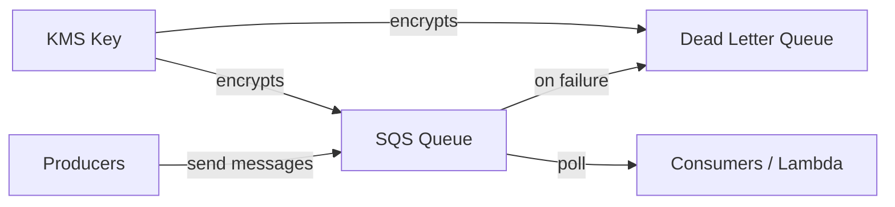

# @sevenpico/cdk-construct-sqs-queue

> **Agent Context**: Before implementing this spec, read [`spec/AGENT-CONTEXT.md`](./AGENT-CONTEXT.md) for the full project context, functional architecture pattern, JSII constraints, and README generation requirements.

## Dependencies
- `@sevenpico/cdk-context` — **must be implemented first**

## Package
`@sevenpico/cdk-construct-sqs-queue`
Directory: `packages/cdk-construct-sqs-queue`

## Source Terraform Module
https://github.com/SevenPico/terraform-aws-sqs-queue

## Purpose
Provisions an SQS queue (standard or FIFO) with optional dead-letter queue, optional KMS encryption, and configurable access policies. The DLQ uses a name derived from the main queue's context ID with a configurable suffix.

---

## CDK Imports
```typescript
import { aws_sqs as sqs, aws_kms as kms, Duration } from 'aws-cdk-lib';
```

## Props Interface (JSII-exported)

```typescript
import { Context } from '@sevenpico/cdk-context';

export interface SqsIamPolicyStatement {
  readonly sid?: string;
  readonly effect?: string;       // 'Allow' | 'Deny'
  readonly principals?: Record<string, string[]>;
  readonly actions: string[];
  readonly resources?: string[];
  readonly conditions?: Record<string, Record<string, string>>;
}

export interface SqsQueueProps {
  readonly context: Context;

  /** Visibility timeout in seconds (0–43200). Default: 30 */
  readonly visibilityTimeoutSeconds?: number;

  /** Message retention period in seconds (60–1209600). Default: 345600 (4 days) */
  readonly messageRetentionSeconds?: number;

  /** Max message size in bytes (1024–262144). Default: 262144 (256KB) */
  readonly maxMessageSizeBytes?: number;

  /** Message delivery delay in seconds (0–900). Default: 0 */
  readonly delaySeconds?: number;

  /** Long-polling wait time in seconds (0–20). Default: 0 */
  readonly receiveWaitTimeSeconds?: number;

  /** Create a FIFO queue. Default: false */
  readonly fifo?: boolean;

  /** FIFO throughput limit. 'perQueue' | 'perMessageGroupId'. FIFO only. */
  readonly fifoThroughputLimit?: string;

  /** Enable content-based deduplication. FIFO only. Default: false */
  readonly contentBasedDeduplication?: boolean;

  /** KMS key ID for SSE-KMS encryption */
  readonly kmsMasterKeyId?: string;

  /** KMS data key reuse period in seconds. Default: 300 */
  readonly kmsDataKeyReusePeriodSeconds?: number;

  /** Enable SQS-managed SSE (SSE-SQS). Default: true */
  readonly sqsManagedSseEnabled?: boolean;

  /** Enable dead-letter queue. Default: false */
  readonly dlqEnabled?: boolean;

  /** DLQ name suffix appended to the queue's context ID. Default: 'dlq' */
  readonly dlqNameSuffix?: string;

  /** Max receive count before message sent to DLQ. Default: 5 */
  readonly dlqMaxReceiveCount?: number;

  /** KMS key ID for DLQ encryption */
  readonly dlqKmsMasterKeyId?: string;

  /** Enable SQS-managed SSE on DLQ. Default: true */
  readonly dlqSqsManagedSseEnabled?: boolean;

  /** Additional IAM policy statements for the queue resource policy */
  readonly iamPolicyStatements?: SqsIamPolicyStatement[];

  /** Limit queue policy to current AWS account. Default: true */
  readonly iamPolicyLimitToCurrentAccount?: boolean;
}
```

---

## Pure Functions (`src/sqs-queue-fns.ts`)

```typescript
import { aws_sqs as sqs, Duration } from 'aws-cdk-lib';
import { Context, contextId, extendContext } from '@sevenpico/cdk-context';

export const queueName = (ctx: Context, props: SqsQueueProps): string =>
  props.fifo ? `${contextId(ctx)}.fifo` : contextId(ctx);

export const dlqContext = (ctx: Context, props: SqsQueueProps): Context =>
  extendContext(ctx, { attributes: [props.dlqNameSuffix ?? 'dlq'] });

export const dlqName = (ctx: Context, props: SqsQueueProps): string => {
  const dCtx = dlqContext(ctx, props);
  return props.fifo ? `${contextId(dCtx)}.fifo` : contextId(dCtx);
};

export const queueEncryption = (props: SqsQueueProps): sqs.QueueEncryption => {
  if (props.kmsMasterKeyId) return sqs.QueueEncryption.KMS;
  if (props.sqsManagedSseEnabled !== false) return sqs.QueueEncryption.SQS_MANAGED;
  return sqs.QueueEncryption.UNENCRYPTED;
};

export const sqsQueueProps = (
  ctx: Context,
  props: SqsQueueProps,
  deadLetterQueue?: sqs.IQueue
): sqs.QueueProps => ({
  queueName:               queueName(ctx, props),
  visibilityTimeout:       Duration.seconds(props.visibilityTimeoutSeconds ?? 30),
  retentionPeriod:         Duration.seconds(props.messageRetentionSeconds ?? 345600),
  maxMessageSizeBytes:     props.maxMessageSizeBytes ?? 262144,
  deliveryDelay:           Duration.seconds(props.delaySeconds ?? 0),
  receiveMessageWaitTime:  Duration.seconds(props.receiveWaitTimeSeconds ?? 0),
  fifo:                    props.fifo ?? false,
  contentBasedDeduplication: props.contentBasedDeduplication ?? false,
  encryption:              queueEncryption(props),
  // encryptionMasterKey set imperatively in constructor if kmsMasterKeyId provided
  deadLetterQueue:         deadLetterQueue ? {
    queue:           deadLetterQueue,
    maxReceiveCount: props.dlqMaxReceiveCount ?? 5,
  } : undefined,
});

export const sqsDlqProps = (ctx: Context, props: SqsQueueProps): sqs.QueueProps => ({
  queueName:   dlqName(ctx, props),
  fifo:        props.fifo ?? false,
  encryption:  props.dlqKmsMasterKeyId ? sqs.QueueEncryption.KMS
               : (props.dlqSqsManagedSseEnabled !== false ? sqs.QueueEncryption.SQS_MANAGED : sqs.QueueEncryption.UNENCRYPTED),
  retentionPeriod: Duration.days(7),
});
```

---

## Construct Class (`src/sqs-queue.ts`)

```typescript
export class SqsQueue extends Construct {
  public readonly queue?: sqs.Queue;
  public readonly deadLetterQueue?: sqs.Queue;

  constructor(scope: Construct, id: string, props: SqsQueueProps) {
    super(scope, id);
    if (!isEnabled(props.context)) return;

    // DLQ first (referenced by main queue)
    if (props.dlqEnabled) {
      const dlqEncKey = props.dlqKmsMasterKeyId
        ? kms.Key.fromKeyArn(this, 'DlqKey', props.dlqKmsMasterKeyId)
        : undefined;

      this.deadLetterQueue = new sqs.Queue(this, 'Dlq', {
        ...sqsDlqProps(props.context, props),
        encryptionMasterKey: dlqEncKey,
      });
    }

    const encKey = props.kmsMasterKeyId
      ? kms.Key.fromKeyArn(this, 'Key', props.kmsMasterKeyId)
      : undefined;

    this.queue = new sqs.Queue(this, 'Queue', {
      ...sqsQueueProps(props.context, props, this.deadLetterQueue),
      encryptionMasterKey: encKey,
    });

    // Additional IAM policy statements
    (props.iamPolicyStatements ?? []).forEach(stmt => {
      this.queue!.addToResourcePolicy(buildPolicyStatement(stmt));
    });

    Object.entries(contextTags(props.context)).forEach(([k, v]) => Tags.of(this).add(k, v));
  }
}
```

---

## Public Properties

| Property | Type | Description |
|----------|------|-------------|
| `queue` | `sqs.Queue \| undefined` | The main SQS queue |
| `deadLetterQueue` | `sqs.Queue \| undefined` | The DLQ (if `dlqEnabled = true`) |

---

## Context Usage

| Context Field | Usage |
|---------------|-------|
| `context.id` | Queue name (base) |
| DLQ context | `extendContext(ctx, { attributes: [dlqNameSuffix] })` → DLQ name |
| `context.tags` | Applied to both queue and DLQ |
| `context.enabled` | If false, no resources created |

---

## BDD Tests

### Feature: Queue Naming

**Scenario: Queue name uses context ID**
- **Given** a context with namespace `7p`, stage `prod`, name `orders`
- **When** an `SqsQueue` construct is created
- **Then** an `AWS::SQS::Queue` resource exists with `QueueName: '7p-prod-orders'`

**Scenario: FIFO queue name appends .fifo suffix**
- **Given** `fifoQueue: true` and a context with id `7p-prod-orders`
- **When** an `SqsQueue` construct is created
- **Then** the queue name is `7p-prod-orders.fifo`

### Feature: Dead Letter Queue

**Scenario: DLQ created with context-derived name**
- **Given** `deadLetterQueueEnabled: true`
- **When** an `SqsQueue` construct is created
- **Then** a second `AWS::SQS::Queue` resource exists with name containing `dlq`
- **And** the main queue has a redrive policy pointing to the DLQ

**Scenario: No DLQ when deadLetterQueueEnabled is false**
- **Given** `deadLetterQueueEnabled: false`
- **When** an `SqsQueue` construct is created
- **Then** only one `AWS::SQS::Queue` resource exists

### Feature: Encryption

**Scenario: SQS-managed encryption by default**
- **Given** no `kmsKeyArn` prop
- **When** an `SqsQueue` construct is created
- **Then** the queue uses SQS-managed server-side encryption

**Scenario: KMS encryption when kmsKeyArn provided**
- **Given** `kmsKeyArn: 'arn:aws:kms:...'`
- **When** an `SqsQueue` construct is created
- **Then** the queue encryption uses the provided KMS key

### Feature: Visibility Timeout

**Scenario: Visibility timeout defaults to 30 seconds**
- **Given** no `visibilityTimeoutSeconds` prop
- **When** `sqsQueueProps(ctx, props)` is called
- **Then** `visibilityTimeout` equals `Duration.seconds(30)`

### Feature: Tagging

**Scenario: Context tags applied to queue**
- **Given** a context with tags
- **When** an `SqsQueue` construct is created
- **Then** the SQS queue has those tags

### Feature: Disabled Construct

**Scenario: No resources created when context is disabled**
- **Given** a context with `enabled: false`
- **When** an `SqsQueue` construct is created
- **Then** no `AWS::SQS::Queue` resources exist in the stack

## README

Generate a `README.md` following the template in [`spec/AGENT-CONTEXT.md`](./AGENT-CONTEXT.md#readme-generation-requirement).

The Mermaid diagram should show:


