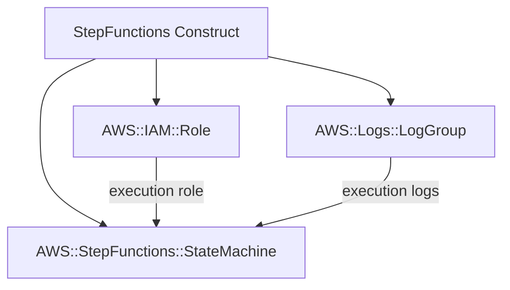

# @sevenpico/cdk-construct-step-functions

> **Agent Context**: Before implementing this spec, read [`spec/AGENT-CONTEXT.md`](./AGENT-CONTEXT.md) for the full project context, functional architecture pattern, JSII constraints, and README generation requirements.

## Dependencies
- `@sevenpico/cdk-context` — **must be implemented first**
- `@sevenpico/cdk-construct-iam-role` — **must be implemented first**

## Package
`@sevenpico/cdk-construct-step-functions`
Directory: `packages/cdk-construct-step-functions`

## Source Terraform Module
https://github.com/SevenPico/terraform-aws-step-functions

## Purpose
Provisions an AWS Step Functions state machine (STANDARD or EXPRESS) with a dedicated IAM execution role, optional CloudWatch logging, and optional X-Ray tracing. Execution role is fully configurable with custom policies and principals.

---

## CDK Imports
```typescript
import {
  aws_stepfunctions as sfn,
  aws_iam as iam,
  aws_logs as logs,
  Duration,
} from 'aws-cdk-lib';
```

## Props Interface (JSII-exported)

```typescript
import { Context } from '@sevenpico/cdk-context';

export interface StepFunctionsLoggingConfig {
  /** Log all execution history. Default: false */
  readonly includeExecutionData?: boolean;
  /** Log level. 'ALL' | 'ERROR' | 'FATAL' | 'OFF'. Default: 'OFF' */
  readonly level?: string;
}

export interface StepFunctionsProps {
  readonly context: Context;

  /** Amazon States Language definition object. Required. */
  readonly definition: object;

  /** State machine type. 'STANDARD' | 'EXPRESS'. Default: 'STANDARD' */
  readonly type?: string;

  /** State machine name override. Default: context.id */
  readonly stateMachineName?: string;

  /** Enable X-Ray tracing. Default: false */
  readonly tracingEnabled?: boolean;

  /** Logging configuration */
  readonly loggingConfiguration?: StepFunctionsLoggingConfig;

  /** Use an existing CloudWatch log group ARN instead of creating one */
  readonly existingLogGroupArn?: string;

  /** Log group name override. Default: derived from context.id */
  readonly logGroupName?: string;

  /** Log group retention in days. Default: 90 */
  readonly logGroupRetentionDays?: number;

  /** KMS key ARN for log encryption */
  readonly cloudwatchLogsKmsKeyArn?: string;

  // IAM Role configuration (passed to underlying role)

  /** Role description. Required. */
  readonly roleDescription: string;

  /** Additional IAM policy document JSON strings */
  readonly policyDocuments?: string[];

  /** Managed policy ARNs to attach to execution role */
  readonly managedPolicyArns?: string[];

  /** Principals allowed to assume the execution role. Default: { Service: ['states.amazonaws.com'] } */
  readonly principals?: Record<string, string[]>;

  /** Max session duration in seconds. Default: 3600 */
  readonly maxSessionDuration?: number;

  /** Permissions boundary ARN */
  readonly permissionsBoundary?: string;

  /** IAM path. Default: '/' */
  readonly path?: string;

  /** If true, use full context ID for role name. Default: true */
  readonly useFullname?: boolean;
}
```

---

## Pure Functions (`src/step-functions-fns.ts`)

```typescript
export const stateMachineName = (ctx: Context, props: StepFunctionsProps): string =>
  props.stateMachineName ?? contextId(ctx);

export const logGroupName = (ctx: Context, props: StepFunctionsProps): string =>
  props.logGroupName ?? `/aws/states/${contextId(ctx)}`;

export const stateMachineType = (props: StepFunctionsProps): sfn.StateMachineType =>
  props.type === 'EXPRESS'
    ? sfn.StateMachineType.EXPRESS
    : sfn.StateMachineType.STANDARD;

export const loggingConfig = (
  logGroup: logs.ILogGroup,
  config?: StepFunctionsLoggingConfig
): sfn.LogOptions => ({
  destination:          logGroup,
  includeExecutionData: config?.includeExecutionData ?? false,
  level:                mapLogLevel(config?.level ?? 'OFF'),
});

const mapLogLevel = (level: string): sfn.LogLevel => {
  const map: Record<string, sfn.LogLevel> = {
    ALL:   sfn.LogLevel.ALL,
    ERROR: sfn.LogLevel.ERROR,
    FATAL: sfn.LogLevel.FATAL,
    OFF:   sfn.LogLevel.OFF,
  };
  return map[level] ?? sfn.LogLevel.OFF;
};
```

---

## Construct Class (`src/step-functions.ts`)

```typescript
export class StepFunctions extends Construct {
  public readonly stateMachine?: sfn.StateMachine;
  public readonly role?: iam.Role;
  public readonly logGroup?: logs.LogGroup;

  constructor(scope: Construct, id: string, props: StepFunctionsProps) {
    super(scope, id);
    if (!isEnabled(props.context)) return;

    // Log group
    let logGroupResource: logs.ILogGroup | undefined;
    if (props.existingLogGroupArn) {
      logGroupResource = logs.LogGroup.fromLogGroupArn(this, 'LogGroup', props.existingLogGroupArn);
    } else {
      this.logGroup = new logs.LogGroup(this, 'LogGroup', {
        logGroupName:  logGroupName(props.context, props),
        retention:     (props.logGroupRetentionDays ?? 90) as logs.RetentionDays,
        encryptionKey: props.cloudwatchLogsKmsKeyArn
          ? kms.Key.fromKeyArn(this, 'LogKey', props.cloudwatchLogsKmsKeyArn)
          : undefined,
        removalPolicy: RemovalPolicy.DESTROY,
      });
      logGroupResource = this.logGroup;
    }

    // IAM execution role
    this.role = new iam.Role(this, 'Role', {
      roleName:    (props.useFullname ?? true) ? contextId(props.context) : props.context.name,
      description: props.roleDescription,
      assumedBy:   new iam.ServicePrincipal('states.amazonaws.com'),
      maxSessionDuration: Duration.seconds(props.maxSessionDuration ?? 3600),
      permissionsBoundary: props.permissionsBoundary
        ? iam.ManagedPolicy.fromManagedPolicyArn(this, 'Boundary', props.permissionsBoundary)
        : undefined,
      path: props.path ?? '/',
    });

    // Additional principals
    const allPrincipals = props.principals ?? { Service: ['states.amazonaws.com'] };
    const cfnRole = this.role.node.defaultChild as iam.CfnRole;
    cfnRole.assumeRolePolicyDocument = buildTrustDocument(allPrincipals).toJSON();

    // Policies
    (props.managedPolicyArns ?? []).forEach((arn, i) =>
      this.role!.addManagedPolicy(iam.ManagedPolicy.fromManagedPolicyArn(this, `Managed${i}`, arn))
    );

    const mergedDoc = mergePolicyDocuments(props.policyDocuments ?? []);
    if (mergedDoc) {
      this.role.attachInlinePolicy(new iam.Policy(this, 'Policy', { document: mergedDoc }));
    }

    // CloudWatch Logs policy for the role
    logGroupResource.grantWrite(this.role);

    // State machine
    this.stateMachine = new sfn.StateMachine(this, 'StateMachine', {
      stateMachineName: stateMachineName(props.context, props),
      definitionBody:   sfn.DefinitionBody.fromString(JSON.stringify(props.definition)),
      stateMachineType: stateMachineType(props),
      role:             this.role,
      tracingEnabled:   props.tracingEnabled ?? false,
      logs:             loggingConfig(logGroupResource, props.loggingConfiguration),
    });

    Object.entries(contextTags(props.context)).forEach(([k, v]) => Tags.of(this).add(k, v));
  }
}
```

---

## Public Properties

| Property | Type | Description |
|----------|------|-------------|
| `stateMachine` | `sfn.StateMachine \| undefined` | The state machine |
| `role` | `iam.Role \| undefined` | The IAM execution role |
| `logGroup` | `logs.LogGroup \| undefined` | CloudWatch log group (if created, not existing) |

---

## Context Usage

| Context Field | Usage |
|---------------|-------|
| `context.id` | State machine name, role name (when `useFullname = true`), log group name |
| `context.tags` | Applied to all resources |
| `context.enabled` | If false, no resources created |

---

## BDD Tests

### Feature: State Machine Naming

**Scenario: State machine uses context ID as name**
- **Given** a context with namespace `7p`, stage `prod`, name `workflow`
- **When** a `StepFunctions` construct is created
- **Then** the state machine name is `7p-prod-workflow`

**Scenario: Custom state machine name overrides context ID**
- **Given** a context and `stateMachineName: 'my-workflow'`
- **When** a `StepFunctions` construct is created
- **Then** the state machine name is `my-workflow`

### Feature: State Machine Type

**Scenario: Standard state machine created by default**
- **Given** a valid context with no `type` prop
- **When** a `StepFunctions` construct is created
- **Then** the state machine type is `STANDARD`

**Scenario: Express state machine created when type is EXPRESS**
- **Given** a valid context and `type: 'EXPRESS'`
- **When** a `StepFunctions` construct is created
- **Then** the state machine type is `EXPRESS`

### Feature: Logging

**Scenario: CloudWatch log group created by default**
- **Given** a valid context with no `existingLogGroupArn`
- **When** a `StepFunctions` construct is created
- **Then** a log group named `/aws/states/{context.id}` exists

**Scenario: Existing log group used when ARN provided**
- **Given** an `existingLogGroupArn` is provided
- **When** a `StepFunctions` construct is created
- **Then** no new `AWS::Logs::LogGroup` resource is created for the state machine

### Feature: Disabled Construct

**Scenario: No resources created when context is disabled**
- **Given** a context with `enabled: false`
- **When** a `StepFunctions` construct is created
- **Then** no `AWS::StepFunctions::StateMachine` resources exist in the stack

## README

Generate a `README.md` following the template in [`spec/AGENT-CONTEXT.md`](./AGENT-CONTEXT.md#readme-generation-requirement).

The Mermaid diagram should show:


